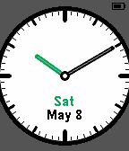
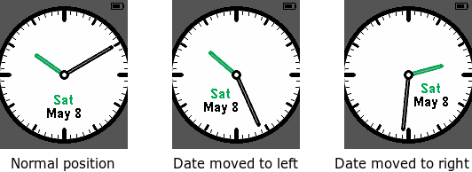
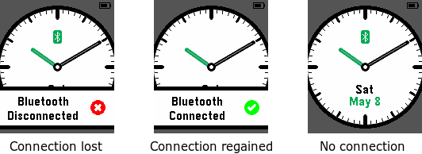
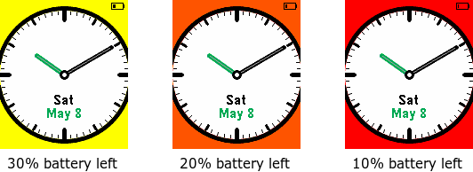

# Obsidian 

This is a usable and elegant analog watchface for the Pebble Time.  It's main features are:

- High contrast colors, clearly visible in most light conditions.
- Display of the current date (day and month) as well as day of the week.
- The date display is never obstructed by the watch hands.  If they would cover the date, the date moves slightly to the side.
- Display of the battery level.
- Change in background for low battery levels (yellow at 30%, orange at 20%, and red at 10%).
- Vibrates when the bluetooth connection is lost or regained, shows an information overlay for a few seconds and keeps showing an icon when no connection is available.

## Screenshots

The main goal when building this watchface was for it to be practical.  For instance, the date display should never be obstructed by the watch hands:

The watchface also alerts the user when the bluetooth connection is lost or regained, by vibrating and showing an information overlay.  After a few seconds, the overlay goes away, and a small bluetooth icon stays if no connection is available:

The watchface always shows a small battery indicator in the top right corner.  However, if the battery starts running low, the background changes to yellow, orange and finally red:

## Building from Source

The project can be build using the command `make build`.  The `Makefile` also includes various other targets, such as ones to install the watchface in an emulator or on the Pebble watch.  There are also targets to automatically take the screenshots that are part of this distribution, but that is likely to not work in environments other than mine.  The official `pebble screenshot` tool is currently broken, which is why an alternative way to obtain a screenshot is used.

## Contributing

Pull requests are welcomed.

## License

Copyright 2015 Stefan Heule

Licensed under the Apache License, Version 2.0 (the "License");
you may not use this file except in compliance with the License.
You may obtain a copy of the License at

    http://www.apache.org/licenses/LICENSE-2.0

Unless required by applicable law or agreed to in writing, software
distributed under the License is distributed on an "AS IS" BASIS,
WITHOUT WARRANTIES OR CONDITIONS OF ANY KIND, either express or implied.
See the License for the specific language governing permissions and
limitations under the License.

## Influence

There are a few watch faces that have influenced the design of Obsidian:

- [Simple.Watch](http://apps.getpebble.com/en_US/application/5551c537c60fc8732d000006)
- [TH3](http://apps.getpebble.com/en_US/application/5551c4a91113bc93a00000de)
