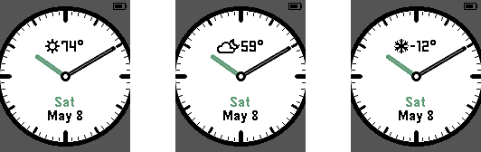
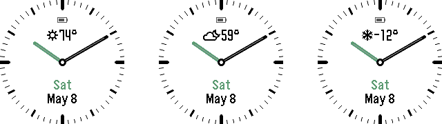
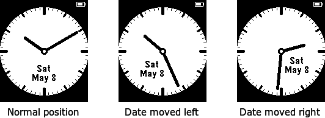
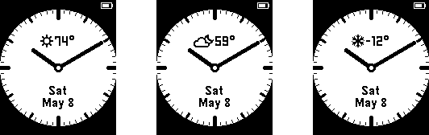
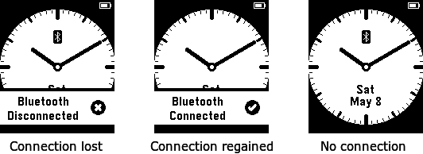
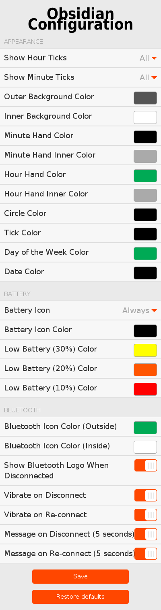

# Obsidian 

Available in the Pebble App Store:

Some information on Obsidian elsewhere:
- [Blog post introducing the initial version of Obsidian](https://stefanheule.com/blog/obsidian-a-usable-and-elegant-analog-watchface-for-the-pebble-time/).
- [Blog post about the weather update to Obsidian](https://stefanheule.com/blog/weather-information-for-obsidian/).

## Overview

This is a usable and elegant analog watchface for the Pebble, Pebble Steel, Pebble Time, Pebble Time Steel as well as the Pebble Time Round.
It's main features are:

- High contrast colors, clearly visible in most light conditions.
- Display of the current date (day and month) as well as day of the week.
- The date display is never obstructed by the watch hands.  If they would cover the date, the date moves slightly to the side.
- Display the current weather information (icon and temperature).  Just like the date, this information is never obstructed.
- Weather information in Celcius or Fahrentheit.  Weather information source is configurable to use [openweathermap.org](http://openweathermap.org/), [forecast.io](http://forecast.io/), or [wunderground.com](https://www.wunderground.com/).  Note that forecast.io and wunderground.com require a (free) API key.
- Weather is displayed for the current location by default, but it is possible to set a fixed location.
- Display of the battery level.
- Change in background for low battery levels (yellow at 30%, orange at 20%, and red at 10%).
- Vibrates when the bluetooth connection is lost or regained, shows an information overlay for a few seconds and keeps showing an icon when no connection is available.
- Fully configurable, both in terms of appearance (colors, minute/hour ticks, etc.) as well as behavior (if and when to vibrate, show messages, etc.).

## Screenshots (Pebble Time and Pebble Time Steel)

The main goal when building this watchface was for it to be practical.  For instance, the date display should never be obstructed by the watch hands:

The watchface also features weather information:

The watchface also alerts the user when the bluetooth connection is lost or regained, by vibrating and showing an information overlay.  After a few seconds, the overlay goes away, and a small bluetooth icon stays if no connection is available:

The watchface always shows a small battery indicator in the top right corner.  However, if the battery starts running low, the background changes to yellow, orange and finally red:

Finally, it is fully configurable, both in terms of what it looks like as well as its behavior (vibration, bluetooth message, etc.).  Some screenshots of different configurations:

The configuration dialog to achieve this flexibility looks as follows:

## Screenshots (Pebble Time Round)

The watchface also supports the Pebble Time Round:

## Screenshots (Pebble and Pebble Steel)

On the original Pebble and Pebble Steel, the colors are limited to black and white, but all other features are still available.  Some screenshots:

## Screenshot of Configuration

## FAQ

**No weather information is displayed**

There are many possible causes:

- Make sure weather is turned on in the settings.
- Ensure that your phone is connected to the internet.
- Make sure the color for the weather information is different from the background color.
- If you use forecast.io or wunderground.com as a weather source, make sure the API key is correct.
- If you use a custom location, make sure it is a valid location.

**What does it mean when the degree sign is missing for the weather?**

In this case, the last attempt to update the weather failed.  This can be for any number of reasons (see above).  Obsidian will keep displaying the previous weather information until it expires.

## Changelog

**Version 2.4 (2016-08-04)**

- Square version of the watch face.
- Use actual temperature rather than "feels like" for forecast.io.

**Version 2.3 (2016-06-25)**

- Fix bug where the minute ticks were not shown in the right color if hour ticks were turned off.

**Version 2.2 (2016-06-22)**

- Fix bug where the bluetooth logo was not displayed on chalk platform when weather was disabled.

**Version 2.1 (2016-06-20)**

- Fix bug that causes the watch face to essentially not work on the aplite platform, due to an out-of-memory condition.

**Version 2.0 (2016-06-18)**

- Added optional weather information.

**Version 1.9 (2015-12-29)**

- Localize date display.

**Version 1.8 (2015-12-17)**

- Update to latest SDK, allowing aplite to make use of new APIs.  The watchface now looks much better on aplite.
- Aplite can now use the color gray (dithered black/white).

**Version 1.7 (2015-12-08)**

- Improve tick size again.

**Version 1.6 (2015-12-08)**

- Fix a bug where the background color setting for 30% battery level was ignored.
- Increase the size of the minute ticks on the PTR (they were mostly covered by the bezel).

**Version 1.5 (2015-12-01)**

- Allow for a different color of the battery icon on low battery (used by default on PTR).
- Separate local storage of configurations for different platforms.
- Fix possible bug in local storage on the watch on upgrade.
- Show version information in the configuration

**Version 1.4**

- Adding a version for the chalk platform (Pebble Time Round).

**Version 1.3**

- Adding a version for the aplite platform (Original Pebble).

**Version 1.0, 1.1, 1.2**

- Initial version

## Building from Source

The project can be build using the command `make build`.  The `Makefile` also includes various other targets, such as ones to install the watchface in an emulator or on the Pebble watch.  There are also targets to automatically take the screenshots that are part of this distribution.

### Versioning

The watchface itself uses relatively arbitrary version numbers of MAJOR.MINOR.  In addition to that, the configuration format (the JavaScript config object) is versioned, too, using a single integer.  Different version of the watchface may share the same configuration format.

| Watchface version | Configuration version |
|------------------:|----------------------:|
|         up to 1.2 |                     1 |
|               1.3 |                     2 |
|               1.4 |                     3 |
|               1.5 |                     4 |
|         1.6 - 1.7 |                     5 |
|         1.8 - 1.9 |                     6 |
|         2.0 - 2.1 |                     7 |
|         2.2 - 2.3 |                     8 |
|               2.4 |                     9 |

## Contributing

Pull requests are welcome.  Also see `DEVELOPER.md` for information on various development matters.

## License

Copyright 2015-16 Stefan Heule

Licensed under the Apache License, Version 2.0 (the "License");
you may not use this file except in compliance with the License.
You may obtain a copy of the License at

    http://www.apache.org/licenses/LICENSE-2.0

Unless required by applicable law or agreed to in writing, software
distributed under the License is distributed on an "AS IS" BASIS,
WITHOUT WARRANTIES OR CONDITIONS OF ANY KIND, either express or implied.
See the License for the specific language governing permissions and
limitations under the License.

## Influence

There are a few watch faces that have influenced the design of Obsidian:

- [Minimalin](https://github.com/groyoh/minimalin).  Great watchface under the [MIT Licence](licences/mit.txt), from
which I borrow some code related to getting weather information.  I also use their NUPE font, which they provide
under the [Open Font Licence](licences/ofl.txt).  I modified the font to include more weather icons, as well as
making some of the existing icons more accurate, and I call the resulting font NUPE2.  For the aplite and basalt
platforms, I modified NUPE2 slightly further to include a smaller font for numbers, and call the font NUPE2_small.
Both modifications are again licenced under the [Open Font Licence](licences/ofl.txt).
- [Simple.Watch](http://apps.getpebble.com/en_US/application/5551c537c60fc8732d000006)
- [TH3](http://apps.getpebble.com/en_US/application/5551c4a91113bc93a00000de)
